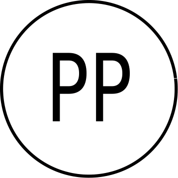

<a id="readme-top"></a>

[![Contributors][contributors-shield]][contributors-url]
[![Issues][issues-shield]][issues-url]
[![GNU][license-shield]][license-url]
[![LinkedIn][linkedin-shield]][linkedin-url]

<br />
<div align="center">
  <a href="https://github.com/jake106/prem_pred">
    
  </a>

<h3 align="center">Prem Predictor</h3>

  <p align="center">
    A currently very basic repository of models designed to predict the results of football matches in the English Premier League. Currently lacking in a number of essential features, but I'm working on it!
    <br />
    <a href="https://github.com/jake106/prem_pred"><strong>Explore the docs »</strong></a>
    <br />
    <br />
    <a href="https://github.com/jake106/prem_pred">View Demo</a>
    ·
    <a href="https://github.com/jake106/prem_pred/issues/new?labels=bug&template=bug-report---.md">Report Bug</a>
    ·
    <a href="https://github.com/jake106/prem_pred/issues/new?labels=enhancement&template=feature-request---.md">Request Feature</a>
  </p>
</div>

<details>
  <summary>Table of Contents</summary>
  <ol>
    <li>
      <a href="#about-the-project">About The Project</a>
    </li>
    <li>
      <a href="#getting-started">Getting Started</a>
      <ul>
        <li><a href="#prerequisites">Prerequisites</a></li>
        <li><a href="#installation">Installation</a></li>
      </ul>
    </li>
    <li><a href="#usage">Usage</a></li>
    <li><a href="#roadmap">Roadmap</a></li>
    <li><a href="#contributing">Contributing</a></li>
    <li><a href="#license">License</a></li>
    <li><a href="#contact">Contact</a></li>
    <li><a href="#acknowledgments">Acknowledgments</a></li>
  </ol>
</details>

## About The Project

Football games are unpredictable, there is no way to predict the outcome of multiple games over an entire league; but what if we could at least do an ok job? If the bookmakers can do it, why can't we?

This repository seeks to answer these questions, through the application of a number of different types of model designed to predict the results of football matches, loosely based on the literature.

<p align="right">(<a href="#readme-top">back to top</a>)</p>


<!-- GETTING STARTED -->
## Getting Started

To get a local copy up and running follow these simple example steps.

### Prerequisites

This project is written in Python version 3.8.5. The required modules can be installed following the instructions below.

* pip
  ```sh
  pip install pandas==2.0.3 numpy==1.20.3 scipy==1.7.0 matplotlib==3.3.1
  ```

### Installation

Note: Currently step 1 is not required, but as the roadmap progresses it will be.

1. Get a free API Key at [https://example.com](https://example.com)
2. Clone the repo
   ```sh
   git clone https://github.com/jake106/prem_pred.git
   ```
4. Enter your API in `config.cfg`
   ```cfg
   api_key = 'ENTER YOUR API';
   ```
5. Change git remote url to avoid accidental pushes to base project
   ```sh
   git remote set-url origin your_github_username/prem_pred
   git remote -v # confirm the changes
   ```

<p align="right">(<a href="#readme-top">back to top</a>)</p>


<!-- USAGE EXAMPLES -->
## Usage

raise NotImplementedError "This is on the roadmap"

_For more examples, please refer to the [Documentation](https://example.com)_

<p align="right">(<a href="#readme-top">back to top</a>)</p>


<!-- ROADMAP -->
## Roadmap

- [ ] Implement prediction capabilities for single matches
- [ ] Implement backtesting framework
- [ ] Automate fetching latest match data
- [ ] Add capability to simulate entire league based on predictions
    - [ ] Find data source for matches to be played
    - [ ] Implement Monte-Carlo simulations based on match result probabilities 
- [ ] Improve documentation
    - [ ] Finish README
        - [ ] Add examples for usage
    - [ ] Improve logo

See the [open issues](https://github.com/jake106/prem_pred/issues) for a full list of proposed features (and known issues).

<p align="right">(<a href="#readme-top">back to top</a>)</p>


<!-- CONTRIBUTING -->
## Contributing

Contributions are what make the open source community such an amazing place to learn, inspire, and create. Any contributions you make are **greatly appreciated**.

If you have a suggestion that would make this better, please fork the repo and create a pull request. You can also simply open an issue with the tag "enhancement".
Don't forget to give the project a star! Thanks again!

1. Fork the Project
2. Create your Feature Branch (`git checkout -b feature/AmazingFeature`)
3. Commit your Changes (`git commit -m 'Add some AmazingFeature'`)
4. Push to the Branch (`git push origin feature/AmazingFeature`)
5. Open a Pull Request

<p align="right">(<a href="#readme-top">back to top</a>)</p>

### Top contributors:

<a href="https://github.com/jake106/prem_pred/graphs/contributors">
  
</a>


<!-- LICENSE -->
## License

Distributed under the GNU General Public License. See `LICENSE.txt` for more information.

<p align="right">(<a href="#readme-top">back to top</a>)</p>


<!-- ACKNOWLEDGMENTS -->
## Acknowledgments

* [README Template](https://github.com/othneildrew/Best-README-Template/tree/main?tab=readme-ov-file)
* [Double-poisson football score model](https://onlinelibrary.wiley.com/doi/abs/10.1111/j.1467-9574.1982.tb00782.x)
* []()

<p align="right">(<a href="#readme-top">back to top</a>)</p>


<!-- MARKDOWN LINKS & IMAGES -->
<!-- https://www.markdownguide.org/basic-syntax/#reference-style-links -->
[contributors-shield]: https://img.shields.io/github/contributors/jake106/prem_pred.svg?style=for-the-badge
[contributors-url]: https://github.com/jake106/prem_pred/graphs/contributors
[forks-shield]: https://img.shields.io/github/forks/jake106/prem_pred.svg?style=for-the-badge
[forks-url]: https://github.com/jake106/prem_pred/network/members
[stars-shield]: https://img.shields.io/github/stars/jake106/prem_pred.svg?style=for-the-badge
[stars-url]: https://github.com/jake106/prem_pred/stargazers
[issues-shield]: https://img.shields.io/github/issues/jake106/prem_pred.svg?style=for-the-badge
[issues-url]: https://github.com/jake106/prem_pred/issues
[license-shield]: https://img.shields.io/github/license/jake106/prem_pred.svg?style=for-the-badge
[license-url]: https://github.com/jake106/prem_pred/blob/master/LICENSE.txt
[linkedin-shield]: https://img.shields.io/badge/-LinkedIn-black.svg?style=for-the-badge&logo=linkedin&colorB=555
[linkedin-url]: https://linkedin.com/in/linkedin_username
[product-screenshot]: images/screenshot.png
[Next.js]: https://img.shields.io/badge/next.js-000000?style=for-the-badge&logo=nextdotjs&logoColor=white
[Next-url]: https://nextjs.org/
[React.js]: https://img.shields.io/badge/React-20232A?style=for-the-badge&logo=react&logoColor=61DAFB
[React-url]: https://reactjs.org/
[Vue.js]: https://img.shields.io/badge/Vue.js-35495E?style=for-the-badge&logo=vuedotjs&logoColor=4FC08D
[Vue-url]: https://vuejs.org/
[Angular.io]: https://img.shields.io/badge/Angular-DD0031?style=for-the-badge&logo=angular&logoColor=white
[Angular-url]: https://angular.io/
[Svelte.dev]: https://img.shields.io/badge/Svelte-4A4A55?style=for-the-badge&logo=svelte&logoColor=FF3E00
[Svelte-url]: https://svelte.dev/
[Laravel.com]: https://img.shields.io/badge/Laravel-FF2D20?style=for-the-badge&logo=laravel&logoColor=white
[Laravel-url]: https://laravel.com
[Bootstrap.com]: https://img.shields.io/badge/Bootstrap-563D7C?style=for-the-badge&logo=bootstrap&logoColor=white
[Bootstrap-url]: https://getbootstrap.com
[JQuery.com]: https://img.shields.io/badge/jQuery-0769AD?style=for-the-badge&logo=jquery&logoColor=white
[JQuery-url]: https://jquery.com 


